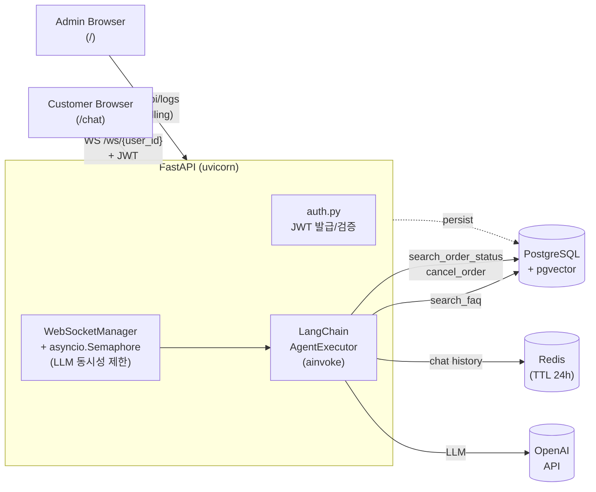

# CS AI Agent

FastAPI 기반 **실시간 CS 채팅 에이전트**. WebSocket으로 사용자와 대화하고, LangChain 에이전트가 RAG(pgvector)와 Tool Calling을 조합해 답변합니다. 대화 히스토리/주문 데이터는 PostgreSQL + Redis로 영속화됩니다.

## Highlights

- **WebSocket 기반 양방향 채팅** — JWT 인증 후 `/ws/{user_id}`로 연결, `typing` → `ai_response` 흐름을 단일 연결에서 처리
- **LangChain Tool-Calling 에이전트** — FAQ RAG(`search_faq`) + 주문 도메인 도구 4종(조회/취소/환불 계산/상담원 핸드오프)
- **pgvector 기반 RAG** — PostgreSQL 단일 스택으로 벡터 검색까지 통합 (별도 ChromaDB 서버 불요)
- **연결 단위 LLM 세션** — `connection_id`를 LangChain `session_id`로 사용해 새 탭/새로고침 = 새 대화. `user_id`는 영속 식별자(`chat_logs`)로 분리
- **외부화된 프롬프트** — `prompts/*.yaml`에서 system prompt 관리, 변경에 재배포 불필요
- **구조화 로깅** — `structlog` 기반, 요청/메시지 단위 `request_id` 컨텍스트 자동 바인딩

## Architecture



## Project Structure

```
app/
├── main.py                 FastAPI 엔트리포인트, lifespan에서 PG/Redis/RAG 초기화
├── config.py               pydantic-settings 기반 환경변수
├── api/
│   ├── auth.py             /api/auth/dev-token, JWT 발급/검증
│   ├── chat_ws.py          /ws/{user_id}, WebSocketManager, 메시지 처리
│   ├── logs.py             /api/logs, /api/logs/{id}/feedback (admin)
│   └── health.py           GET /
├── agent/
│   ├── rag.py              pgvector 인덱싱 + AgentExecutor 구성, Redis ChatMessageHistory
│   └── tools.py            4 tools: search_order_status / cancel_order / refund_calculator / transfer_to_human
├── storage/
│   ├── database.py         SQLAlchemy AsyncEngine
│   ├── models.py           ORM (chat_logs, orders)
│   ├── repositories/       chat_log_repo, order_repo
│   └── redis_client.py     redis-py async client
├── prompt/loader.py        YAML 프롬프트 로더
└── observability/logger.py structlog 설정 + request_id 컨텍스트

prompts/
└── cs_agent_v1.yaml        system prompt + Decision Protocol

dashboard/                  Next.js 16 + React 19 + Tailwind 4
├── app/page.tsx            Admin 대시보드 (대화 로그 / 통계 / 피드백)
└── app/chat/page.tsx       Customer 채팅 UI (WebSocket)

db/
├── init.sql                테이블 + pgvector extension
└── seed.sql                테스트용 orders 시드

docker-compose.yml          postgres (pgvector/pg16) + redis + app
```

## Tech Stack

| Layer | 사용 기술 |
|---|---|
| Backend | Python 3.11, FastAPI, uvicorn, SQLAlchemy 2 (async), psycopg v3 |
| AI / LLM | LangChain, OpenAI (gpt-4o-mini), pgvector |
| Storage | PostgreSQL 16 (+ pgvector extension), Redis 7 |
| Auth | PyJWT (HS256), `dev-token` 엔드포인트 (debug 한정) |
| Frontend | Next.js 16, React 19, Tailwind CSS 4 |
| Observability | structlog (JSON 로그) |
| Dev | Docker Compose, ruff, pytest + pytest-asyncio |

## Quick Start

### 1. Prerequisites
- Docker Desktop
- Python 3.11
- Node.js 20+
- OpenAI API Key

### 2. 환경변수 설정
```bash
cp .env.example .env
```

`.env`에서 최소한 다음 두 개를 채웁니다:
- `OPENAI_API_KEY` — OpenAI 키
- `JWT_SECRET_KEY` — `python -c "import secrets; print(secrets.token_urlsafe(32))"`

### 3. 인프라 + 백엔드 기동
```bash
# PostgreSQL + Redis (백그라운드)
docker compose up -d postgres redis

# Python 의존성
pip install -r requirements.txt

# FastAPI 서버
uvicorn app.main:app --host 0.0.0.0 --port 8001 --reload
```

> 💡 전체를 컨테이너로 띄우려면 `docker compose up`만 실행하면 됩니다 (Dockerfile.dev 사용).

### 4. 대시보드 기동
```bash
cd dashboard
npm install
npm run dev
```

| URL | 용도 |
|---|---|
| `http://localhost:3000` | 어드민 대시보드 (대화 로그, 통계, 피드백) |
| `http://localhost:3000/chat` | 고객용 채팅 UI |
| `http://localhost:8001/docs` | FastAPI Swagger UI |

## API & WebSocket Protocol

### REST
| Method | Path | 용도 |
|---|---|---|
| `GET` | `/` | 헬스체크 |
| `POST` | `/api/auth/dev-token` | 개발용 JWT 발급 (`debug=true`일 때만 활성) |
| `GET` | `/api/logs` | 어드민: 전체 대화 로그 |
| `PUT` | `/api/logs/{log_id}/feedback` | 어드민: 응답 피드백(👍/👎) |

### WebSocket — `/ws/{user_id}?token=<JWT>`

```
Client → Server
  { "type": "user_message", "message": "B202 주문 상태 알려줘" }

Server → Client
  { "type": "typing" }
  { "type": "ai_response", "message": "..." }
  { "type": "error",       "message": "..." }   ← 잘못된 payload 등
```

연결 close 코드: `4001` 인증 실패, `4002` 잘못된 메시지 형식.

## Agent Tools

| Tool | 동작 |
|---|---|
| `search_faq` | pgvector retriever — `data/faq.txt` 기반 RAG |
| `search_order_status` | `orders` 테이블 조회. 가격/구매일/경과일 반환 |
| `cancel_order` | "상품 준비 중" 상태에서만 취소 |
| `refund_calculator` | 가격 + 경과일 → 환불 비율 계산 (≤7일 100% / ≤14일 90% / >14일 불가) |
| `transfer_to_human` | 상담원 핸드오프 시그널 |

System prompt(`prompts/cs_agent_v1.yaml`)의 Decision Protocol이 도구 사용 흐름을 가이드합니다.

## Development

```bash
# 테스트
pytest

# 린트 & 포맷
ruff check .
ruff format .
```

테스트는 외부 API(LLM, Redis, PostgreSQL)를 mocking합니다. 의존성 주입을 위한 fixture는 `tests/conftest.py` 참조.

## License

MIT
